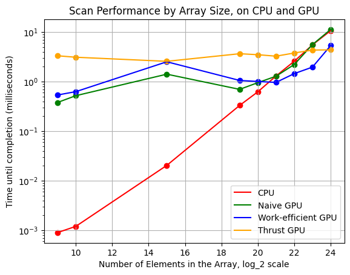
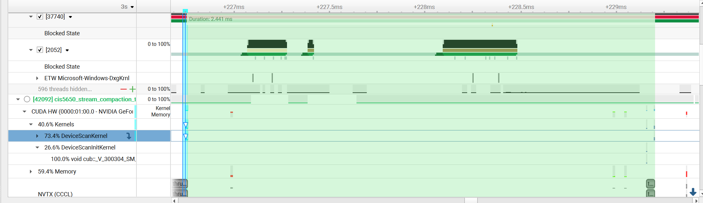
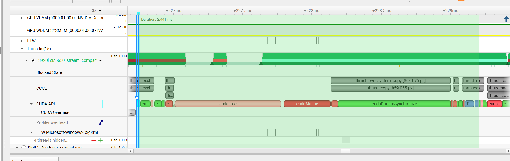

CUDA Stream Compaction
======================

**University of Pennsylvania, CIS 565: GPU Programming and Architecture, Project 2**

* Rebecca Feng
  * = [LinkedIn](https://www.linkedin.com/in/beckyfeng0803/), [personal website](https://beckyfeng08.github.io/)
Tested on: Windows 11, AMD Ryzen 9 @ 2.50 GHz 8GB, GTX 5060
Visual Studio 2022, CUDA 13.3

## Description

This repo explores implementations of stream compaction and scan/prefix sums. 

Scan implementations include:
- CPU: Uses a for loop to compute the sum in a given array
- Naive: On the GPU. Builds partial sums by adding some index i and i - 2^(d - 1)th together, where d is dth pass of adding, with log_2(n) total passes until we sum up all the elements of the array.
- Work-efficient: On the GPU. Builds partial sums by modifying the array in-place via upsweeping and downsweeping.
- Thrust: Using the Thrust library's version of scan to compare performance between our implementation vs theirs

Stream compaction implementations include:
- CPU without scan: Stream compaction without the scan function where we loop over all elements of the array and populate the output array whenever data[i] != 0
- CPU with scan: Invokes the scan function - sets up an array of 0's and 1's depending on if the elements in the input array are "valid", applies the scan function to it to receive the indices necessary for copying to the output array
- Work-efficient: Same as previous, but on the GPU and invokes work-efficient scan function.

### Block size optimization
We find that a block size of 128 works best for our computer in terms of providing us with the least time needed, on average, to execute out the naive and work-efficient scan functions.

### Evaluating performance
All of the following data were taken on Release mode, for array sizes of power-of-twos.

#### CPU and GPU Scan Performance Results
| Size of Array (log_2 scale) | CPU (ms) | Naive (ms) | Work-Efficient (ms) | Thrust (ms) |
| ------------: | -------: | ---------: | ------------------: | ----------: |
|             9 |   0.0009 |      0.379 |               0.536 |       3.312 |
|            10 |   0.0012 |      0.519 |               0.626 |       3.094 |
|            15 |   0.0204 |      1.409 |               2.506 |       2.560 |
|            19 |     0.33 |      0.696 |               1.053 |       3.644 |
|            20 |    0.621 |      0.950 |               1.004 |       3.480 |
|            21 |    1.296 |      1.282 |               0.962 |       3.251 |
|            22 |    2.572 |      2.206 |               1.447 |       3.768 |
|            23 |    5.493 |      5.567 |               1.956 |       4.318 |
|            24 |    10.63 |     11.230 |               5.320 |       4.360 |



We see that for large array sizes (greater than 2^21 elements, our work-efficient GPU scan starts to surpass the performance of our CPU scan, which increases linearly). Our naive GPU scan implementation roughly performs similarly to the CPU implementation. Meanwhile, our thrust wrapper performs relatively uniformly wrt time, regardless of how large of an array we feed into it, and starts to perform better compared to all of our other algorithms after extremely large array sizes, at a size of 2^24. However, it is the most inefficient with smaller sized arrays. NSight systems provides us the following data for our executable running on an array with 2^18 elements:




The first image shows us the interval of time at which DeviceScanKernel was invoked. Looking at the second image, we see that the overhead is not due to the exclusive scan itself (in gray at the very end), but actually due to several preprocessing memory computations such as cudaFree, cudaMalloc, and thrust::two_system_copy.

In terms of other performance bottlenecks, also testing with 2^18 elements in our array:
- CPU: Number of elements in our array grows linearly with time - the bottleneck is in the algorithm presented here itself.
- Naive GPU: Scan function is bottleneck and takes up the most time (0.297 milliseconds). The process of changing it from an inclusive to exclusive scan takes very little to no time (0.004 milliseconds). Copying over memory from host to device also take little to no time (around 0.081 milliseconds)
- Work-efficient GPU: We see that memory computations take up  around 1/2 of the execution process (around 1 millisecond total), whereas the upsweep and downsweeping process itself takes up another millisecond.

Release version test output, for a 2^18 sized array (we only measure the actual algorithm running and not any memory computations):
```

****************
** SCAN TESTS **
****************
    [  14  42  25  38  34   7  14  48  43   0  13   7  39 ...  29   0 ]
==== cpu scan, power-of-two ====
   elapsed time: 0.1914ms    (std::chrono Measured)
    [   0  14  56  81 119 153 160 174 222 265 265 278 285 ... 6416043 6416072 ]
==== cpu scan, non-power-of-two ====
   elapsed time: 0.155ms    (std::chrono Measured)
    [   0  14  56  81 119 153 160 174 222 265 265 278 285 ... 6415948 6415978 ]
    passed
==== naive scan, power-of-two ====
   elapsed time: 0.50288ms    (CUDA Measured)
    passed
==== naive scan, non-power-of-two ====
   elapsed time: 0.353984ms    (CUDA Measured)
    passed
==== work-efficient scan, power-of-two ====
   elapsed time: 0.800544ms    (CUDA Measured)
    passed
==== work-efficient scan, non-power-of-two ====
   elapsed time: 0.568288ms    (CUDA Measured)
    passed
==== thrust scan, power-of-two ====
   elapsed time: 3.37571ms    (CUDA Measured)
    passed
==== thrust scan, non-power-of-two ====
   elapsed time: 0.762944ms    (CUDA Measured)
    passed

*****************************
** STREAM COMPACTION TESTS **
*****************************
    [   2   0   0   2   0   3   1   3   2   2   1   2   2 ...   3   0 ]
==== cpu compact without scan, power-of-two ====
   elapsed time: 0.9799ms    (std::chrono Measured)
    [   2   2   3   1   3   2   2   1   2   2   2   1   1 ...   3   3 ]
    passed
==== cpu compact without scan, non-power-of-two ====
   elapsed time: 1.1217ms    (std::chrono Measured)
    [   2   2   3   1   3   2   2   1   2   2   2   1   1 ...   2   1 ]
    passed
==== cpu compact with scan ====
   elapsed time: 0.3701ms    (std::chrono Measured)
    [   2   2   3   1   3   2   2   1   2   2   2   1   1 ...   3   3 ]
    passed
==== work-efficient compact, power-of-two ====
   elapsed time: 0.912448ms    (CUDA Measured)
    passed
==== work-efficient compact, non-power-of-two ====
   elapsed time: 0.945728ms    (CUDA Measured)
    passed
```

